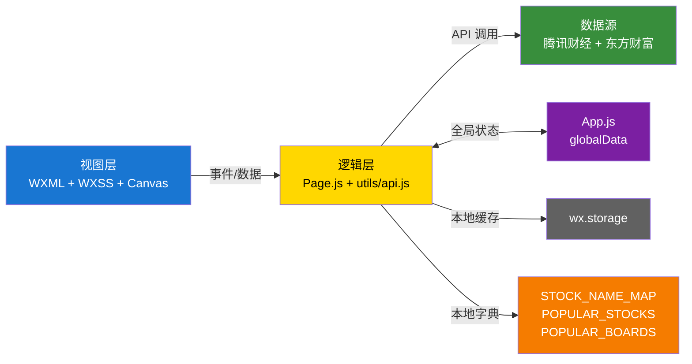
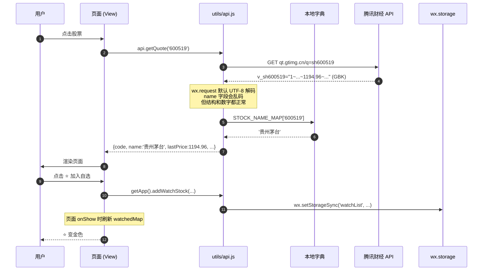

# A股探子 小程序 — 详细实现

> 版本：v1.2  
> 日期：2026-07-07  
> 项目代号：A股探子（"8"=龙头 + "15"=2026-01-05 立项目 + 概念板块龙头分析）
> 文档定位：系统架构、代码实现、API 设计、Bug 修复、配置说明

> 这是三份文档中的第 3 份：
> 1. [需求分析](./1-需求分析.md)
> 2. [UI 设计](./2-UI设计.md)
> 3. [详细实现](./3-详细实现.md)（本文）

---

## 零、系统架构图

### 0.1 整体架构

```mermaid
graph TB
    subgraph Client["微信小程序 (客户端)"]
        subgraph Pages["页面层 (Pages)"]
            P1[首页]
            P2[板块列表]
            P3[板块详情]
            P4[股票详情]
            P5[自选股]
            P6[事件列表]
            P7[事件详情]
            P8[设置]
            P9[API调试]
            P10[指数详情]
            P11[行情搜索]
        end
        
        subgraph Utils["工具层 (utils/)"]
            API[api.js<br/>StockAPI 类<br/>23 个方法]
            DATA[data.js<br/>格式化工具]
            STORE[storage.js<br/>本地存储]
        end
        
        subgraph LocalData["本地数据"]
            NAME_MAP[STOCK_NAME_MAP<br/>100+ 只股票名]
            POPULAR_STOCKS[POPULAR_STOCKS<br/>100+ 只热门股]
            POPULAR_BOARDS[POPULAR_BOARDS<br/>20 个板块]
            INDEX_CODES[INDEX_CODES<br/>6 个指数]
        end
        
        subgraph GlobalState["全局状态 (app.globalData)"]
            WS[watchList<br/>自选股]
            ST[settings<br/>设置]
            US[userInfo<br/>用户信息]
        end
    end
    
    subgraph External["外部数据源"]
        TX_RT["qt.gtimg.cn<br/>实时行情<br/>(GBK 编码)"]
        TX_KLINE["web.ifzq.gtimg.cn<br/>K线数据<br/>(UTF-8 JSON)"]
        TX_MINUTE["qt.gtimg.cn<br/>分时数据"]
        DC_NOTICE["np-anotice-stock<br/>.eastmoney.com<br/>公告"]
        DC_DATA["datacenter-web<br/>.eastmoney.com<br/>板块数据"]
    end
    
    subgraph Storage["本地存储"]
        SS[wx.storage]
    end
    
    Pages --> Utils
    Pages --> GlobalState
    Utils --> LocalData
    Utils --> External
    GlobalState <--> SS
    
    style Client fill:#1a2a4a
    style Pages fill:#16213E
    style Utils fill:#FFD700,color:#000
    style LocalData fill:#0F1A2F
    style External fill:#2E7D32
```



### 0.2 分层架构



### 0.3 数据流总图



---

## 一、项目概述

### 1.1 目标
为 A 股投资者提供一个**聚焦龙头股**的微信小程序，帮助用户：
- 快速浏览**概念板块 / 行业板块**异动
- 一键查看**成分股详情**（含 K 线、资金流向、公告）
- 维护**自选股**，实时查看行情
- 浏览**热点事件**，关联相关个股
- 查看**指数详情**（分时图、K线、涨跌家数）

### 1.2 核心特性
- 📊 实时行情（12 个核心 API）
- 🎨 深色主题（暗色 UI，长时间看不累眼）
- ⭐ 自选股管理
- 📱 完整股票详情页（K线图、Canvas 蜡烛图、资金流向可视化）
- 📈 指数详情页（分时图、K线、市场概况）
- 🔍 股票搜索（本地热门股字典）
- 🛠 内置 API 调试页

---

## 二、技术架构

### 2.1 技术栈
| 层级 | 选型 |
|------|------|
| 框架 | 微信小程序原生 |
| 渲染 | WXML + WXSS + Canvas 2D（K线图/分时图） |
| 数据源 | **腾讯财经** qt.gtimg.cn + web.ifzq.gtimg.cn |
| 本地存储 | wx.setStorageSync + utils/storage.js |
| 状态管理 | App.globalData + Page.setData |
| 总代码量 | ~8500 行（含调试页） |

### 2.2 数据源架构

```
┌─────────────────────────────────────────┐
│           微信小程序                       │
│  ┌─────────────────────────────────┐   │
│  │       pages (视图层)              │   │
│  └──────────────┬──────────────────┘   │
│                 │ 调 api.xxx()          │
│  ┌──────────────▼──────────────────┐   │
│  │  utils/api.js (StockAPI 类)        │   │
│  │  - 行情 / K线 / 分时 / 搜索 / 板块 │   │
│  │  - 本地字典 (STOCK_NAME_MAP)        │   │
│  └──────────────┬──────────────────┘   │
└─────────────────┼──────────────────────┘
                  │
        ┌─────────┼─────────┬─────────┐
        ▼         ▼         ▼         ▼
   ┌────────┐ ┌──────┐ ┌──────────┐ ┌────────────┐
   │腾讯实时│ │腾讯K线│ │腾讯分时  │ │东方财富公告 │
   │GBK编码│ │UTF-8 │ │GBK编码   │ │ datacenter │
   └────────┘ └──────┘ └──────────┘ └────────────┘
```

### 2.3 数据流（股票详情页示例）

```
用户点击同花顺
        ↓
watch.js onStockTap
        ↓
wx.navigateTo → stock-detail
        ↓
stock-detail onLoad(options) 接收 code
        ↓
loadAll() (Promise.allSettled 并行 4 个 API)
        ├── loadQuote()       → api.getQuote
        ├── loadKLine()       → api.getKLine  
        ├── loadCapitalFlow() → api.getCapitalFlow
        └── loadAnnouncements()→ api.getStockAnnouncements
        ↓
setData 更新 4 个字段
        ↓
WXML 渲染：4 个 Tab (K线/资金/公告/详情)
        ↓
用户切换 Tab → 切换 activeTab
```

---

## 三、目录结构

```
a-stock-analyzer/
├── app.js                    # 全局入口（191 行）
├── app.json                  # 应用配置（注册 11 个页面）
├── app.wxss                  # 全局样式（深色主题、通用类）
├── project.config.json       # 项目配置
├── sitemap.json              # SEO 站点地图
│
├── utils/                    # 工具层
│   ├── api.js                # ★ 核心 API 封装（800+ 行）
│   ├── api-eastmoney-backup.js  # 旧版东方财富 API（977 行）
│   ├── data.js               # 数据格式化（formatNumber/formatChangePct/...）
│   └── storage.js            # 缓存 / 自选股 / 设置存储
│
├── pages/                    # 页面层（11 个页面）
│   ├── index/                # 首页（市场概览）
│   ├── index-detail/         # ★ 指数详情（分时/K线/市场概况）
│   ├── board/                # 板块列表
│   ├── board-detail/         # 板块详情（成分股）
│   ├── stock-detail/         # ★ 股票详情（4 Tab + Canvas K线）
│   ├── stock/                # ★ 行情搜索（搜索股票+加自选）
│   ├── watch/                # 自选股
│   ├── event/                # 热点事件
│   ├── event-detail/         # 事件详情
│   ├── setting/              # 设置（含 debug 入口）
│   └── debug/                # ★ API 调试面板（10 个测试点）
│
├── assets/                   # 静态资源
│   └── icons/                # TabBar 图标（12 个 PNG）
├── components/               # 自定义组件（未使用）
│
├── 1-需求分析.md             # 需求分析文档
├── 2-UI设计.md               # UI/UX 设计文档
└── 3-详细实现.md             # 本文档
```

---

## 四、核心模块设计

### 4.1 utils/api.js (StockAPI 类)

**职责**：所有外部数据请求的统一入口

**类方法清单**（23 个）：

| 类别 | 方法 | 数据源 | 说明 |
|------|------|--------|------|
| 行情 | `getQuote(code)` | qt.gtimg.cn | 单只股票（GBK 编码） |
| 行情 | `getQuotes(codes)` | qt.gtimg.cn | 批量股票 |
| 行情 | `getIndexQuote(code)` | qt.gtimg.cn | 单个指数 |
| 行情 | `getMainIndices()` | qt.gtimg.cn | 4 大指数（沪深创科创） |
| 行情 | `getMarketSummary()` | qt.gtimg.cn | 涨跌家数统计 |
| K线 | `getKLine(code, kType, n)` | web.ifzq.gtimg.cn | 日/周/月 K线 |
| 分时 | `getMinuteLine(code)` | qt.gtimg.cn | 分时行情数据 |
| 搜索 | `searchStock(keyword)` | 本地字典 | 100+ 只热门股 |
| 搜索 | `searchLocal(keyword)` | 本地字典 | 本地搜索核心 |
| 板块 | `getConceptBoards(limit)` | 本地字典 + getQuotes | 20 个概念板块 |
| 板块 | `getIndustryBoards(limit)` | 同上 | 行业板块 |
| 板块 | `getBoardDetail(code, n)` | 本地字典 | 成分股 + 龙头股 |
| 板块 | `getBoardRank(limit)` | 本地 | 板块涨幅榜 |
| 资金 | `getCapitalFlow(code)` | stock/get | 当日主力净流入 |
| 公告 | `getStockAnnouncements(code, n)` | np-anotice-stock | 个股公告 |
| 涨跌 | `getTopGainers/Losers(n)` | 本地 | 涨跌幅榜 |
| 涨跌 | `getLimitUp/Down(n)` | 本地 | 涨停/跌停股 |
| 事件 | `getEvents(type, n)` | 本地生成 | 热点事件（动态生成） |
| 综合 | `getOverview()` | 组合 | 首页综合数据 |

### 4.2 GBK 编码处理

**关键发现**：`qt.gtimg.cn` 返回 GBK 编码，微信 wx.request 默认按 UTF-8 解码。

**问题**：
- 中文名称会变乱码（如 `贵州茅台` → `����ę́`）
- 数字字段**完全正常**（GBK 数字字符与 ASCII 兼容）

**解决方案**：
- ✅ **不解析中文名**（从本地 `STOCK_NAME_MAP` 字典取）
- ✅ 数字字段直接 `Number()` 解析
- ✅ 结构完整性保持（正则 `v_([^=]+)="([^"]+)"` 能正确匹配）

### 4.3 指数与个股字段差异（关键修复）

**问题**：指数和个股的成交量/成交额字段单位不同

| 字段 | 个股 | 指数 | 修复前 | 修复后 |
|------|------|------|--------|--------|
| fields[6] | 成交量（手） | 成交量（股） | 统一按手处理 | 指数 ÷ 100 |
| fields[36] | 成交额（万元） | 重复成交量 | 统一按万元处理 | 指数改用 fields[37] |
| fields[37] | - | 成交额（万元） | 未使用 | 指数用此字段 |

**代码实现**：
```javascript
const isIndex = INDEX_CODES.includes(code) || 
                (code.startsWith('000') && code.length === 6) ||
                (code.startsWith('399') && code.length === 6);

let volume, amount;
if (isIndex) {
  volume = num(fields[6]) / 100;      // 股 → 手
  amount = num(fields[37]) / 10000;   // 万元 → 亿元
} else {
  volume = num(fields[6]);            // 手
  amount = num(fields[36]) / 10000;   // 万元 → 亿元
}
```

### 4.4 字段映射（已验证 v_sh600519）

| 索引 | 含义 | 示例值 |
|------|------|--------|
| [1] | 名称（乱码，用字典替换）| `贵州茅台` |
| [3] | 当前价 | `1194.96` |
| [4] | 昨收 | `1168.63` |
| [5] | 今开 | `1169.00` |
| [6] | 成交量(手/股) | `66878` |
| [30] | 时间 (YYYYMMDDHHmmss) | `20260629161429` |
| [31] | 涨跌额 | `26.33` |
| [32] | 涨跌幅% | `2.25` |
| [33] | 最高 | `1215.00` |
| [34] | 最低 | `1151.01` |
| [36] | 成交额(万元) - 个股 | `794924` |
| [37] | 成交额(万元) - 指数 | `76401640` |
| [43] | 振幅% | `5.48` |
| [44] | 流通市值(亿) | `14937.98` |
| [45] | 总市值(亿) | `14937.98` |
| [46] | 市盈率(动) | `6.41` |
| [47] | 涨停价 | `1285.49` |
| [48] | 跌停价 | `1051.77` |
| [52] | 换手率% | `13.71` |

### 4.5 本地字典（避免依赖搜索 API）

**STOCK_NAME_MAP**（100+ 只）：
- 来源：`POPULAR_STOCKS` 数组
- 用途：`parseTxQuote` 替换 GBK 乱码名称
- 字段：code → name

**INDEX_CODES**（6 个指数）：
- 用途：区分指数和个股的字段解析逻辑
- 包含：`000001`(上证), `399001`(深证), `399006`(创业板), `000688`(科创50), `000300`(沪深300), `000905`(中证500)

**POPULAR_BOARDS**（20 个板块）：
- 用途：`getConceptBoards` / `getBoardDetail` 用本地板块
- 字段：code / name / stocks（成分股代码数组）
- 板块涨幅 = 成分股平均涨幅

**POPULAR_STOCKS**（100+ 只热门股）：
- 用途：`searchStock` 搜索
- 字段：code / name / pinyin / abbr / market
- 覆盖：白酒、银行、保险、证券、新能源、半导体、医药、消费、地产等主要板块

### 4.6 关键 WXML 模式

#### 4.6.1 五角星自选（避免 indexOf）
```xml
<!-- 旧（O(n)，易错） -->
<view class="star {{watchedStocks.indexOf(item.code) > -1 ? 'active' : ''}}">★</view>

<!-- 新（O(1)，可靠） -->
<view class="star {{watchedMap[item.code] ? 'active' : ''}}">★</view>
```

#### 4.6.2 wx:for + wx:if 组合
```xml
<!-- 错误：直接组合 -->
<view wx:for="{{list}}" wx:if="{{index < 5}}">  ❌

<!-- 正确：用 <block> 包裹 -->
<block wx:for="{{list}}" wx:key="code">
  <view wx:if="{{index < 5}}">  ✅
</block>
```

#### 4.6.3 WXS 模块（绕开 WXML 不支持链式调用）
```xml
<!-- WXML 中 -->
<wxs src="./format.wxs" module="fmt" />
<text>{{fmt.fmtPct(item.changePct)}}</text>

<!-- format.wxs -->
function fmtPct(v) { return +v > 0 ? '+' + (+v).toFixed(2) : (+v).toFixed(2); }
```

---

## 五、页面设计

### 5.1 页面流程图

```
┌──────────────────────────────────────────────────────────────────┐
│                       首页 (index)                                │
│   [4大指数] [热点板块] [板块排行] [自选股]                          │
│   ↑ 可点击进入指数详情                                            │
└──┬────────────┬────────────┬──────────────┬─────────────────────┘
   ↓            ↓            ↓              ↓
指数详情     板块详情      股票详情        自选股
(index-detail)(board-detail)(stock-detail)  (watch)
   │              ↓              ↓              ↓
   └→ 分时/K线/    股票详情       Tab: K线/资金/    股票详情
      市场概况                    公告/详情
                                      ↓
                                   事件详情
                                 (event-detail)
```

### 5.1.1 完整用户旅程

```mermaid
journey
    title A股探子 用户典型使用流程
    section 启动
      打开小程序: 4: 首页加载
      首页看到市场概览: 3: 4 大指数 + 热点板块
    section 指数详情
      点击上证指数: 5: 进入指数详情
      查看分时图: 4: 实时走势 + 均价线
      切换到日K: 4: K线图 + 表格
    section 浏览
      切换到板块 tab: 4: 看 20 个概念/行业板块
      点击人工智能板块: 5: 进入板块详情
      查看成分股列表: 4: 成分股 + 龙头股
    section 详情
      点击科大讯飞: 5: 进入股票详情
      查看 K线图: 4: 日K + 表格
      切换到资金流向: 4: 主力净流入 + 4 条进度条
      点击⭐加入自选: 5: 跳转回，自选股更新
    section 自选
      进入自选 tab: 4: 同花顺、科大讯飞等
      点击搜索更多: 5: 进入行情搜索页面
      搜索茅台: 4: 找到贵州茅台
    section 退出
      下拉刷新: 4: 所有数据更新
      关闭小程序: 3: 收工
```

### 5.2 页面清单

| 路径 | 功能 | TabBar |
|------|------|--------|
| `pages/index/index` | 首页（市场概览） | ✅ 首页 |
| `pages/index-detail/index-detail` | 指数详情（分时/K线/市场概况） | - |
| `pages/board/board` | 板块列表 | ✅ 板块 |
| `pages/board-detail/board-detail` | 板块详情+成分股 | - |
| `pages/stock-detail/stock-detail` | 股票详情（4 Tab） | - |
| `pages/stock/stock` | 行情搜索（搜索股票+加自选） | - |
| `pages/watch/watch` | 自选股 | ✅ 自选 |
| `pages/event/event` | 热点事件 | ✅ 事件 |
| `pages/event-detail/event-detail` | 事件详情 | - |
| `pages/setting/setting` | 设置（含 debug 入口） | ✅ 设置 |
| `pages/debug/debug` | API 调试面板（开发用） | - |

### 5.3 TabBar 导航（5 项）

| 序号 | 页面 | 图标 | 功能 |
|------|------|------|------|
| 1 | 首页 | home.png | 市场概览 |
| 2 | 板块 | board.png | 概念板块列表 |
| 3 | 事件 | event.png | 热点事件 |
| 4 | 自选 | star.png | 自选股管理 |
| 5 | 设置 | setting.png | 系统设置 |

> **注**：行情搜索页面通过自选页面的"搜索更多"按钮进入，微信小程序 TabBar 最多支持 5 项。

### 5.4 指数详情页功能

| 模块 | 数据 | 展示 |
|------|------|------|
| 基本信息 | api.getIndexQuote | 指数名称、代码、当前价、涨跌幅 |
| 行情数据 | api.getIndexQuote | 今开、昨收、最高、最低、成交量、成交额、换手率、量比、振幅、涨停价、跌停价、市盈率 |
| 市场概况 | api.getMarketSummary | 上涨家数、平盘家数、下跌家数及占比 |
| 分时图 | api.getMinuteLine | Canvas 绘制，红色实线价格线 + 绿色虚线均价线 |
| K线图 | api.getKLine | Canvas 蜡烛图 + 周期切换（日K/周K/月K） |

### 5.5 股票详情页 4 个 Tab

| Tab | 数据 | 展示 |
|-----|------|------|
| **K线** | api.getKLine | Canvas 蜡烛图 + 周期切换（日/周/月）+ 8 行表格 |
| **资金流向** | api.getCapitalFlow | 主力净流入大数字 + 4 条进度条（特大/大/中/小） |
| **公告** | api.getStockAnnouncements | 公告列表（标题+时间+分类） |
| **详情** | api.getQuote | 8 个指标卡（市值/PE/振幅/涨跌停价） |

### 5.6 行情搜索页功能

| 功能 | 说明 |
|------|------|
| 🔍 股票搜索 | 支持按名称/代码/拼音/简称搜索 |
| 🔥 热门股票 | 默认展示茅台、五粮液、宁德时代等热门股 |
| ⭐ 加自选 | 点击星星图标快速添加/移除自选股 |
| 📈 实时行情 | 显示最新价、涨跌幅 |
| 👆 点击跳转 | 点击股票查看详情 |

---

## 六、数据结构

### 6.1 自选股（app.globalData.watchList）

```javascript
[
  { code: '600519', name: '贵州茅台', addTime: 1719648000000,
    alertPriceUp: null, alertPriceDown: null,
    alertChangePct: null, notes: '' },
  ...
]
```

存储：`wx.setStorageSync('watchList', watchList)`

### 6.2 用户设置（app.globalData.settings）

```javascript
{
  pushEnabled: true,
  pushFrequency: 'realtime',  // realtime / morning / evening
  defaultSortBy: 'changePct', // changePct / marketCap / volume
  theme: 'dark'                // dark / light
}
```

### 6.3 行情数据（getQuote 返回）

```javascript
{
  code: '600519',
  name: '贵州茅台',
  isIndex: false,              // 新增：是否为指数
  market: '沪A',
  lastPrice: 1194.96,
  preClose: 1168.63,
  openPrice: 1169.00,
  highPrice: 1215.00,
  lowPrice: 1151.01,
  changeAmount: 26.33,
  changePct: 2.25,
  volume: 66878,              // 手
  amount: 794.92,             // 亿元
  amplitude: 5.48,
  turnoverRate: 13.71,
  peDynamic: 6.41,
  totalMarketCap: 14937.98,    // 亿元
  floatMarketCap: 14937.98,    // 亿元
  upperLimit: 1285.49,
  lowerLimit: 1051.77,
  time: '20260629161429',
  updateTime: 1719687064000
}
```

### 6.4 指数行情数据（isIndex: true）

```javascript
{
  code: '399006',
  name: '创业板指',
  isIndex: true,
  market: '创业板',
  lastPrice: 3948.86,
  preClose: 4019.93,
  openPrice: 4050.88,
  highPrice: 4063.63,
  lowPrice: 3903.48,
  changeAmount: -71.07,
  changePct: -1.77,
  volume: 216576771,          // 股 ÷ 100 = 2165767.71 手
  amount: 7640.16,            // 亿元（fields[37] ÷ 10000）
  amplitude: 3.98,
  turnoverRate: 0.90,
  peDynamic: 23.28,
  totalMarketCap: 76401639.56, // 亿元
  floatMarketCap: 168036.54,   // 亿元
  upperLimit: 4380.41,
  lowerLimit: 2126.32,
  time: '20260706161436',
  updateTime: Date.now()
}
```

### 6.5 分时数据（getMinuteLine 返回）

```javascript
{
  code: '399006',
  name: '创业板指',
  time: '20260706',
  prices: [4050.88, 4045.22, 4038.15, ...],
  avgPrices: [4050.88, 4048.55, 4045.12, ...],
  volumes: [12500000, 25800000, 38900000, ...],
  times: ['09:30', '09:31', '09:32', ...],
  updateTime: Date.now()
}
```

---

## 七、API 设计

### 7.1 wx.request 通用封装

```javascript
function request(url, options = {}) {
  return new Promise((resolve, reject) => {
    wx.request({
      url,
      method: options.method || 'GET',
      timeout: options.timeout || 10000,
      header: { ...COMMON_HEADERS, ...(options.header || {}) },
      data: options.data || {},
      responseType: options.responseType || 'text',
      success: (res) => res.statusCode === 200 ? resolve(res.data) : reject(...),
      fail: (err) => reject(...)
    });
  });
}
```

### 7.2 代码前缀转换（toTxCode）

```javascript
function toTxCode(code) {
  if (code.startsWith('sh') || code.startsWith('sz') || code.startsWith('bj')) {
    return code;
  }
  if (/^[69]/.test(code) || (/^000/.test(code) && code.length === 6)) {
    return 'sh' + code;
  }
  if (/^[03]/.test(code)) {
    return 'sz' + code;
  }
  if (/^[84]/.test(code)) {
    return 'bj' + code;
  }
  return code;
}
```

**关键修复**：`000xxx` 开头的指数（如 `000001` 上证指数）需要映射为 `sh` 前缀，而非 `sz`。

### 7.3 错误处理策略

```javascript
async loadAll() {
  const results = await Promise.allSettled([
    this.loadQuote(),
    this.loadKLine(),
    this.loadCapitalFlow(),
    this.loadAnnouncements()
  ]);
  const errors = results
    .filter(r => r.status === 'rejected')
    .map(r => r.reason?.message || String(r.reason));
}
```

### 7.4 微信小程序合法域名白名单

需要在 [微信公众平台](https://mp.weixin.qq.com) 配置：

```
qt.gtimg.cn                   # 腾讯实时行情 + 分时数据
web.ifzq.gtimg.cn             # 腾讯 K线
np-anotice-stock.eastmoney.com # 东方财富公告
datacenter-web.eastmoney.com   # 东方财富板块数据
```

---

## 八、关键 Bug 修复历程

### 8.1 2026-06-30 初始问题

| # | 问题 | 原因 | 解决 |
|---|------|------|------|
| 1 | WXML 链式方法调用报错 | WXML 不支持链式属性访问 | 改用 WXS 模块 |
| 2 | WXS 不支持 `Number()` | WXS 解析限制 | 用 `+value` 转换 |
| 3 | `wx:for` 内嵌 `wx:if` 报错 | 同标签冲突 | 用 `<block>` 包裹 |
| 4 | WXSS 缺少 `}` | 替换时丢失样式 | 重写完整块 |
| 5 | 东方财富 push2 IP 封禁 | 所有子域名返回 code=000 | 切换到腾讯财经数据源 |
| 6 | GBK 编码中文乱码 | wx.request 默认 UTF-8 解码 | 用本地字典替换名称 |

### 8.2 2026-07-06 数据准确性修复

| # | 问题 | 原因 | 解决 |
|---|------|------|------|
| 7 | 指数代码前缀错误 | `000xxx` 指数被映射为 `sz` 前缀 | `toTxCode()` 添加沪市指数判断 |
| 8 | 指数成交量单位错误 | 指数 fields[6] 是股，不是手 | 指数 ÷ 100 转换 |
| 9 | 指数成交额字段错误 | 指数 fields[36] 是重复成交量 | 改用 fields[37] |
| 10 | 市值字段乘以 1e8 | 接口已返回亿元单位 | 移除错误乘法 |

### 8.3 2026-07-07 功能完善

| # | 问题 | 原因 | 解决 |
|---|------|------|------|
| 11 | 设置页面为空 | 缺少内边距和样式 | 添加 padding 和 safe-area-bottom |
| 12 | 事件页面信息来源不统一 | 布局混乱 | 统一左下角左对齐 |
| 13 | TabBar 超过 5 项 | 微信小程序限制 | 行情页面改为从自选页入口 |
| 14 | 搜索功能不可用 | 远程搜索接口返回 404 | 移除远程搜索，增强本地字典 |

---

## 九、调试工具

### 9.1 调试页（pages/debug/debug）

**10 个测试点**：
1. 主要指数（自动）
2. 涨停股（自动）
3. 概念板块 TOP5（自动）
4. 单股行情（输入代码）
5. 批量行情（输入多个代码）
6. 板块详情（输入 BKxxxx）
7. 股票搜索（输入关键词）
8. K线（输入代码+周期）
9. 资金流向（输入代码）
10. 个股公告（输入代码）

**特性**：
- 🟢 实时状态：每个测试项显示 ✓/✗ 和耗时（ms）
- 📋 复制 JSON：一键复制原始数据
- 🔄 重测按钮：单独重跑某个接口

### 9.2 入口
**设置 → 关于 → 🔧 API调试面板**

---

## 十、限制与待优化

### 10.1 当前限制

| 限制 | 影响 | 临时方案 |
|------|------|----------|
| 板块只有 20 个 | 用户看不到全市场板块 | 后续用 datacenter 扩展 |
| 热门股只有 100+ 只 | 搜索覆盖不全 | 本地字典已覆盖主要板块龙头 |
| 没有真实资金流向历史 | 只能看当日 | 后续可对接 Choice/通联 |
| 没有分钟 K线 | 只能看日/周/月 | 腾讯免费接口无分钟线 |
| 没有 WebSocket 推送 | 轮询有延迟 | app.js 已有模拟 WebSocket |
| 公告只有个股公告 | 无行业/政策公告 | 待扩展 |

### 10.2 待优化功能

- [ ] **首页 7×24 实时模式**（WebSocket 推送）
- [ ] **价格预警**（自选股涨跌幅/价格触发通知）
- [ ] **新闻聚合**（按板块分类的热点资讯）
- [ ] **龙虎榜**（每日游资动向）
- [ ] **板块联动**（A 板块涨带动 B 板块的相关性分析）
- [ ] **PDF 研报导出**（用 wx.createSelectorQuery 截图）
- [ ] **K线图改进**：MACD/KDJ/RSI 指标
- [ ] **多股对比**（同时看 2-3 只股票 K线）

### 10.3 代码质量

- ✅ 所有页面使用真实数据（之前的 mock 数据已替换）
- ⚠️ 部分 WXSS 重复代码（可抽公共样式）
- ⚠️ 缺单元测试

---

## 十一、微信小程序配置

### 11.1 合法域名白名单

```
请求合法域名 (request):
  - qt.gtimg.cn
  - web.ifzq.gtimg.cn
  - np-anotice-stock.eastmoney.com
  - datacenter-web.eastmoney.com
```

### 11.2 调试设置
- **本地设置 → 不校验合法域名**（开发期可绕过）
- **ES6 转 ES5**：启用
- **样式补全**：启用

### 11.3 性能优化

- ✅ `Promise.allSettled` 并行加载
- ✅ 本地字典避免重复网络请求
- ✅ `request` 统一超时（10s）
- ✅ `setData` 最小化更新
- ✅ `wx:if` 按需渲染
- ✅ 分时数据缓存（5秒）

---

## 十二、版本历史

| 版本 | 日期 | 改动 |
|------|------|------|
| v0.1 | 2026-01-05 | 项目初始化（mock 数据）|
| v0.5 | 2026-06-28 | 接入东方财富 API |
| v0.8 | 2026-06-29 | 重写 utils/api.js（真接口）|
| v0.9 | 2026-06-29 | 加调试页 + 股票详情页 |
| v1.0 | 2026-06-30 | 切换到腾讯财经数据源（东方财富被封）|
| **v1.1** | **2026-07-06** | **修复指数数据错误 + 新增指数详情页 + 事件信息来源** |
| **v1.2** | **2026-07-07** | **新增行情搜索页面 + 修复设置页 + 完善搜索功能** |

---

## 十三、文件清单

### 13.1 核心文件

| 文件 | 行数 | 说明 |
|------|------|------|
| `app.js` | 191 | 全局入口 |
| `app.json` | 66 | 应用配置 |
| `utils/api.js` | 800+ | 核心 API 封装 |
| `utils/data.js` | ~100 | 数据格式化 |
| `utils/storage.js` | ~50 | 本地存储 |

### 13.2 页面文件

| 文件 | 行数 | 说明 |
|------|------|------|
| `pages/index/index.js` | ~130 | 首页 |
| `pages/index-detail/index-detail.js` | ~200 | 指数详情 |
| `pages/board/board.js` | ~80 | 板块列表 |
| `pages/board-detail/board-detail.js` | ~100 | 板块详情 |
| `pages/stock-detail/stock-detail.js` | ~200 | 股票详情 |
| `pages/stock/stock.js` | ~120 | 行情搜索 |
| `pages/watch/watch.js` | ~130 | 自选股 |
| `pages/event/event.js` | ~100 | 热点事件 |
| `pages/event-detail/event-detail.js` | ~80 | 事件详情 |
| `pages/setting/setting.js` | ~80 | 设置 |
| `pages/debug/debug.js` | ~200 | API 调试 |

### 13.3 图标资源

| 文件 | 说明 |
|------|------|
| `assets/icons/home.png/active.png` | 首页图标 |
| `assets/icons/board.png/active.png` | 板块图标 |
| `assets/icons/event.png/active.png` | 事件图标 |
| `assets/icons/star.png/active.png` | 自选图标 |
| `assets/icons/setting.png/active.png` | 设置图标 |
| `assets/icons/stock.png/active.png` | 行情图标（备用） |

---

## 十四、附录

### 14.1 关键技术点速查

```bash
# 检查语法
node -c utils/api.js
node -c pages/debug/debug.js

# 测试 API（命令行）
curl -s -m 5 "https://qt.gtimg.cn/q=sh600519" -H "Referer: https://gu.qq.com/"

# 测试指数
curl -s -m 5 "https://qt.gtimg.cn/q=sh000001" -H "Referer: https://gu.qq.com/"

# 测试分时数据
curl -s -m 5 "https://qt.gtimg.cn/q=s_sh000001" -H "Referer: https://gu.qq.com/"

# 解码 GBK（macOS）
curl -s ... | iconv -f GBK -t UTF-8
```

### 14.2 常用 WXML 模式

```xml
<!-- 列表渲染 -->
<block wx:for="{{list}}" wx:key="id">
  <view class="item" bindtap="onTap" data-id="{{item.id}}">{{item.name}}</view>
</block>

<!-- 条件渲染 -->
<view wx:if="{{show}}">显示</view>
<view wx:elif="{{other}}">其他</view>
<view wx:else>默认</view>

<!-- 格式化数字（用 WXS） -->
<wxs src="./utils.wxs" module="u" />
<text>{{u.fmt(item.price)}}</text>

<!-- 自选状态（用 Map） -->
<text class="star {{watchedMap[item.code] ? 'active' : ''}}">★</text>

<!-- Canvas 绘制 K线 -->
<canvas type="2d" id="klineCanvas" class="kline-canvas"></canvas>
```

### 14.3 调试 Checklist

- [ ] 微信开发者工具合法域名白名单已配置
- [ ] 详情 → 本地设置 → "不校验合法域名" 勾选
- [ ] Console 无红色错误
- [ ] Network 面板请求返回 200
- [ ] 首页四大指数数据正确（成交量、成交额）
- [ ] 指数详情页分时图正常显示
- [ ] 搜索功能能找到热门股票
- [ ] 自选股添加/移除功能正常
- [ ] 真机预览测试扫码可用

---

**文档维护者**：vengo bot  
**最后更新**：2026-07-07 18:00